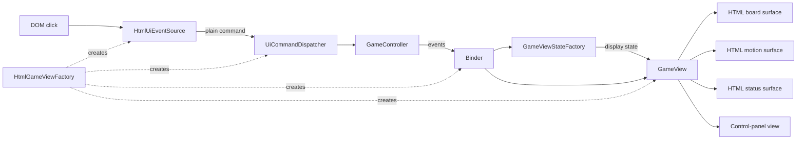

# View Architecture

The view is implemented with ES module factory functions, not JavaScript classes. Its public browser entry point is `createHtmlGameView()`.

## Runtime flow



The two directions are intentionally short:

```text
DOM click -> plain UI command -> binder/controller
Controller event -> binder -> state mapper -> GameView -> renderers
```

## Core modules

- `GameViewBinder.mjs` owns controller subscriptions, setup navigation state, AI-thinking state, and stale async-operation guards.
- `GameViewStateFactory.mjs` converts controller/model data into DOM-free display state.
- `GameView.mjs` coordinates rendering and the lift, slide, land, and captured-piece fade sequence.
- `GameViewAnimationLifecycle.mjs` owns the active animation promise, cancellation signal, and generation guard.
- `HtmlGameViewFactory.mjs` builds the HTML implementation and preserves the required ordering between view bookkeeping and synchronous controller events.

The animation lifecycle remains separate because a boolean is insufficient: cancelling one animation must not allow its late completion to clear a newer animation.

## HTML layer

Only `view/html/**` accesses the DOM or CSS implementation details.

- `HtmlBoardSurface.mjs` builds and incrementally updates squares, pieces, and move hints.
- `HtmlMotionSurface.mjs` implements the semantic animation methods consumed by `GameView` and resolves them from browser animation completion.
- `HtmlStatusSurface.mjs` builds and updates turn, count, thinking, and result displays.
- `HtmlControlPanelSurface.mjs` builds the setup controls and owns game-area dimming while setup is expanded.
- `HtmlElementRegistry.mjs` shares landmark and square elements between board and motion rendering.
- `HtmlUiEventSource.mjs` uses one delegated click listener and emits model-coordinate commands.

Style maps and templates are data/helpers rather than architectural layers.

## UI commands

The event source emits plain objects; it does not build actor/action/intent wrapper objects.

```js
{ type: 'selectPiece', position: { r: 5, c: 0 } }
{ type: 'chooseMoveTarget', position: { r: 4, c: 1 } }
{ type: 'chooseGameMode', mode: 'pve' }
{ type: 'chooseDifficulty', difficulty: 'hard' }
{ type: 'startGame' }
```

`UiCommandDispatcher.mjs` maps controller commands and view-only setup navigation.

For start and restart commands, the binder must update its flags before dispatch. `GameController.reset()` emits `stateChanged` synchronously, so reversing that order renders stale setup state.

## Boundaries to preserve

- `GameView` and `GameViewBinder` stay free of DOM, HTML, selector, and CSS-class details.
- Renderers receive display state rather than reading controller state directly.
- `showMoveMade()` continues to return the complete animation promise.
- Animation cancellation and generation guards remain intact.
- Board rendering is suppressed while a move animation owns the board.
- Worker-backed AI analysis stays outside the view layer.

The boundary and game-flow tests under `tests/view/` protect these behaviors.
