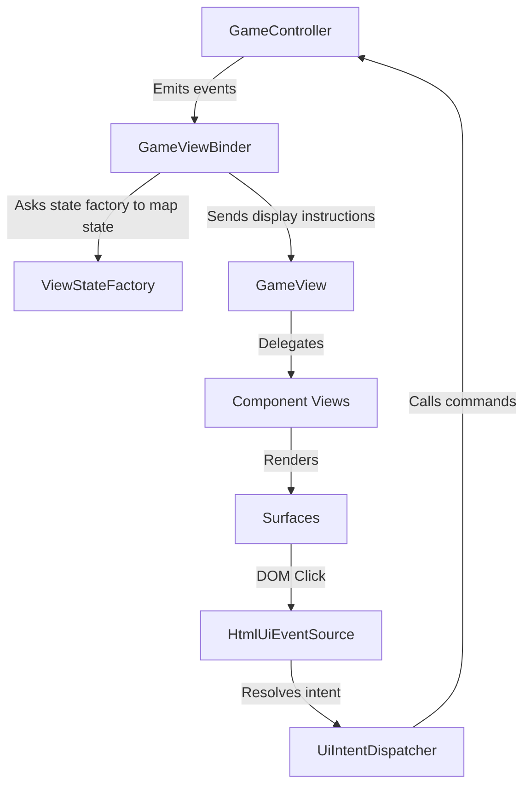

# View Architecture and Class Diagram

This document details the architectural design and structural relationships of the `view` directory in the `thai-checkers-esm` project.

---

## Architectural Patterns

The codebase employs a highly decoupled **Model-View-Presenter (MVP)** / **Model-View-Intent (MVI)** architectural pattern implemented using pure ES Modules and closures (factory functions) rather than ES6 class syntax.



The system is separated into four layers:

1. **The Binder & State Factory**: [GameViewBinder](file:///home/arme/Projects/thai-checkers-esm/view/GameViewBinder.mjs) listens to controller events, requests translated read-only states from [GameViewStateFactory](file:///home/arme/Projects/thai-checkers-esm/view/GameViewStateFactory.mjs), and instructs the visual facade.
2. **The View Facade & Components**: [GameView](file:///home/arme/Projects/thai-checkers-esm/view/GameView.mjs) coordinates the board, animations, status, and control panels. These are modeled as semantic component views ([BoardView](file:///home/arme/Projects/thai-checkers-esm/view/components/board/BoardView.mjs), [BoardMoveAnimationView](file:///home/arme/Projects/thai-checkers-esm/view/components/board/BoardMoveAnimationView.mjs), [GameStatusView](file:///home/arme/Projects/thai-checkers-esm/view/components/status/GameStatusView.mjs), and [ControlPanelView](file:///home/arme/Projects/thai-checkers-esm/view/components/control-panel/ControlPanelView.mjs)) which know nothing about HTML, DOM, CSS, or timers. `GameView` tracks whether a move animation is currently in flight through a dedicated collaborator, [GameViewAnimationLifecycle](file:///home/arme/Projects/thai-checkers-esm/view/GameViewAnimationLifecycle.mjs), rather than ad hoc flags of its own.
3. **Surfaces**: Located under `view/html/surfaces/`, these modules (e.g. [HtmlBoardSurface](file:///home/arme/Projects/thai-checkers-esm/view/html/surfaces/HtmlBoardSurface.mjs), [HtmlMotionSurface](file:///home/arme/Projects/thai-checkers-esm/view/html/surfaces/HtmlMotionSurface.mjs)) are the only parts of the application that touch the browser DOM, set CSS classes, and run timers or animations. They look up elements via [HtmlElementRegistry](file:///home/arme/Projects/thai-checkers-esm/view/html/HtmlElementRegistry.mjs).
4. **Intent Flow**: The user actions are captured by a single delegated event listener in [HtmlUiEventSource](file:///home/arme/Projects/thai-checkers-esm/view/html/HtmlUiEventSource.mjs), translated by [resolveUiIntent](file:///home/arme/Projects/thai-checkers-esm/view/intent/UiIntentResolver.mjs) into a structured [UiIntent](file:///home/arme/Projects/thai-checkers-esm/view/intent/UiIntent.mjs), and mapped to controller actions by [UiIntentDispatcher](file:///home/arme/Projects/thai-checkers-esm/view/intent/UiIntentDispatcher.mjs).

---

## Detailed Module Reference

Below are the key modules and their responsibilities:

### View Core & Orchestration

- **[HtmlGameViewFactory.mjs](file:///home/arme/Projects/thai-checkers-esm/view/html/HtmlGameViewFactory.mjs)**: The composition root. Wires the view components, surfaces, registry, intent dispatcher, event source, and the controller together.
- **[GameView.mjs](file:///home/arme/Projects/thai-checkers-esm/view/GameView.mjs)**: Public view facade. Orchestrates the sub-views and delegates all in-flight-animation bookkeeping to `GameViewAnimationLifecycle`. Move/capture animation follows a strict **lift → slide → land → fade-captured** sequence, with the settled board and next-turn hints applied only after the final stage resolves.
- **[GameViewAnimationLifecycle.mjs](file:///home/arme/Projects/thai-checkers-esm/view/GameViewAnimationLifecycle.mjs)**: Tracks the single active move animation as one explicit record (`generation`, `AbortController`, done `Promise`) instead of separately-nulled variables. A monotonic generation counter guards against a stale, late-resolving animation clobbering a newer one that started after it was cancelled (e.g. back-to-back AI moves).
- **[GameViewBinder.mjs](file:///home/arme/Projects/thai-checkers-esm/view/GameViewBinder.mjs)**: Subscribes to [GameController](file:///home/arme/Projects/thai-checkers-esm/controller/GameController.mjs) events and translates them to view instructions using mapped state from [GameViewStateFactory](file:///home/arme/Projects/thai-checkers-esm/view/GameViewStateFactory.mjs). Post-move status and next-turn hints are deferred until `showMoveMade()` resolves, guarded by a move-render generation so stale events cannot overwrite a newer move.
- **[GameViewStateFactory.mjs](file:///home/arme/Projects/thai-checkers-esm/view/GameViewStateFactory.mjs)**: Pure functional translation layer converting controller/model state structures into display-friendly structures.

### Semantic Component Views

- **[BoardView.mjs](file:///home/arme/Projects/thai-checkers-esm/view/components/board/BoardView.mjs)**: Manages rendering of the board squares.
- **[BoardSquareView.mjs](file:///home/arme/Projects/thai-checkers-esm/view/components/board/BoardSquareView.mjs)**: Data structure representing a square.
- **[BoardMoveAnimationView.mjs](file:///home/arme/Projects/thai-checkers-esm/view/components/board/BoardMoveAnimationView.mjs)**: Interface representing the active animation flow (ripples, sliding piece clones, capture fades).
- **[ControlPanelView.mjs](file:///home/arme/Projects/thai-checkers-esm/view/components/control-panel/ControlPanelView.mjs)**: Maps configuration states and toggles visibility of controls.
- **[GameStatusView.mjs](file:///home/arme/Projects/thai-checkers-esm/view/components/status/GameStatusView.mjs)**: Renders the match information, active turn, piece counts, and reset actions.

### HTML Surfaces (DOM Implementers)

- **[HtmlBoardSurface.mjs](file:///home/arme/Projects/thai-checkers-esm/view/html/surfaces/HtmlBoardSurface.mjs)**: Manages the squares, coordinates, and piece DOM elements. Uses a change cache to prevent unnecessary DOM mutations.
- **[HtmlMotionSurface.mjs](file:///home/arme/Projects/thai-checkers-esm/view/html/surfaces/HtmlMotionSurface.mjs)**: Handles CSS transitions, slide animations, fading captured pieces, and ripple visuals on the board. Move/capture animation follows a strict **lift → slide → land → fade-captured** sequence, with each stage awaited via the browser's animation/transition lifecycle.
- **[HtmlStatusSurface.mjs](file:///home/arme/Projects/thai-checkers-esm/view/html/surfaces/HtmlStatusSurface.mjs)**: Direct DOM renderer for player turn indicators, winner modals, and status text.
- **[HtmlControlPanelSurface.mjs](file:///home/arme/Projects/thai-checkers-esm/view/html/surfaces/HtmlControlPanelSurface.mjs)**: Direct DOM renderer for game configuration, modes, difficulty buttons, start buttons, and layout toggles.
- **[HtmlLayoutSurface.mjs](file:///home/arme/Projects/thai-checkers-esm/view/html/surfaces/HtmlLayoutSurface.mjs)**: Configures overall screen layout states (e.g. dimming the game board when the setup panel is expanded).

---

## Class and Interface Diagram

The diagram below represents the modular system, including factory signatures, dependencies, and composition hierarchies.

```mermaid
classDiagram
    direction TB

    %% Composition Root & Wires
    class HtmlGameViewFactory {
        +createHtmlGameView(controller, rootId) Object
    }

    class HtmlElementRegistry {
        +root Element
        +getSetupPanel() Element
        +getStatusPanel() Element
        +getGameArea() Element
        +getBoard() Element
        +registerSquare(position, element) void
        +getSquare(position) Element
    }

    %% Wires & Events
    class HtmlUiEventSource {
        -listeners Array~Function~
        +onUiEvent(listener) void
        -handleClick(event) void
        -emit(rawEvent) void
    }

    class UiIntentResolver {
        +resolveUiIntent(rawEvent) UiIntent
    }

    class UiIntent {
        +actor UiActor
        +action UiAction
        +isSelectPiece() boolean
        +isChooseMoveTarget() boolean
        +isChooseGameMode() boolean
        +isChooseDifficulty() boolean
        +isStartGame() boolean
        +isRestartGame() boolean
        +isExpandSetup() boolean
        +isCollapseSetup() boolean
    }

    class UiIntentDispatcher {
        +dispatchIntent(intent) void
    }

    %% Controller Binder & State
    class GameViewBinder {
        -gameStarted boolean
        -isAIThinking boolean
        -backupConfig Object
        +isGameStarted() boolean
        +isAIThinking() boolean
        +refreshNow() void
        +markGameStarted() void
        +markSetupExpanded() void
        +markSetupCollapsed() void
        +markGameStopped() void
        -handleMoveMade(evt) void
    }

    class GameViewStateFactory {
        +toPieceDisplay(boardValue) Object
        +toPieceDisplays(board) Array
        +createBoardState(controller) Object
        +createStatusState(controller, flags) Object
        +createControlPanelState(controller, flags) Object
        +createFromController(controller, flags) Object
        +createMoveDisplay(controller, move) Object
    }

    %% Main Facade
    class GameView {
        -animationLifecycle GameViewAnimationLifecycle
        +isAnimating() boolean
        +refresh(viewState) void
        +refreshBoard(boardState) void
        +refreshStatus(statusState) void
        +showSetupScreen(viewState) void
        +showPlayingScreen(viewState) void
        +showGameOverScreen(viewState) void
        +waitForAnimation() Promise
        +showMoveMade(moveDisplay, settledViewState) Promise
        +stopAnimation() void
    }

    class GameViewAnimationLifecycle {
        -current Object
        -generation number
        +isAnimating() boolean
        +waitForAnimation() Promise
        +beginAnimation(run) Promise
        +cancelAnimation() void
    }
    note for GameViewAnimationLifecycle
        Single active-animation record.
        No separate "settling" phase: the animation
        promise itself is the source of truth.
    end note

    %% Semantic Views
    class BoardView {
        +showBoard() void
        +render(boardState) void
    }

    class BoardMoveAnimationView {
        +showPieceMoving(moveDisplay, signal) Promise
        +showCapturedPieceFading(position, signal) Promise
        +showPieceLanding(position, signal) Promise
        +showMoveRipple(position, signal) Promise
        +clearAnimationLayer() void
    }

    class GameStatusView {
        +render(state) void
    }

    class ControlPanelView {
        +modeOptions Array
        +difficultyOptions Array
        +render(state) void
    }

    %% Surfaces
    class HtmlBoardSurface {
        -state Map
        +createBoard() void
        +createSquare(position, squareDisplay) Element
        +render(boardRenderState) void
    }

    class HtmlMotionSurface {
        -animLayer Element
        +slidePiece(moveDisplay, signal) Promise
        +fadeCapturedPiece(position, signal) Promise
        +showPieceLanding(position, signal) Promise
        +showMoveRipple(position, signal) Promise
        +clearMotionLayer() void
    }
    note for HtmlMotionSurface
        Provides the DOM motion primitives orchestrated by GameView.
        Every primitive returns a Promise tied to the browser's CSS
        transition/animation lifecycle, not a JS timer.
    end note

    class HtmlStatusSurface {
        +render(state) void
    }

    class HtmlControlPanelSurface {
        +buildModeButtons(options) void
        +buildDifficultyButtons(options) void
        +render(state) void
    }

    class HtmlLayoutSurface {
        +showGameAreaActive() void
        +showGameAreaDimmed() void
    }

    %% Relationships and Dependencies
    HtmlGameViewFactory ..> HtmlElementRegistry : creates
    HtmlGameViewFactory ..> HtmlUiEventSource : creates
    HtmlGameViewFactory ..> GameView : creates
    HtmlGameViewFactory ..> GameViewBinder : creates
    HtmlGameViewFactory ..> UiIntentDispatcher : creates

    HtmlUiEventSource --> UiIntentResolver : uses
    UiIntentResolver --> UiIntent : creates
    UiIntentDispatcher --> UiIntent : consumes

    GameViewBinder --> GameView : controls
    GameViewBinder --> GameViewStateFactory : calls
    GameViewBinder --> GameController : observes

    GameView *-- BoardView : composes
    GameView *-- BoardMoveAnimationView : composes
    GameView *-- GameStatusView : composes
    GameView *-- ControlPanelView : composes
    GameView *-- HtmlLayoutSurface : composes
    GameView *-- GameViewAnimationLifecycle : composes

    BoardView o-- HtmlBoardSurface : delegates to
    BoardMoveAnimationView o-- HtmlMotionSurface : delegates to
    GameStatusView o-- HtmlStatusSurface : delegates to
    ControlPanelView o-- HtmlControlPanelSurface : delegates to

    HtmlBoardSurface ..> HtmlElementRegistry : lookups
    HtmlMotionSurface ..> HtmlElementRegistry : lookups
    HtmlStatusSurface ..> HtmlElementRegistry : lookups
    HtmlControlPanelSurface ..> HtmlElementRegistry : lookups
    HtmlLayoutSurface ..> HtmlElementRegistry : lookups
```
